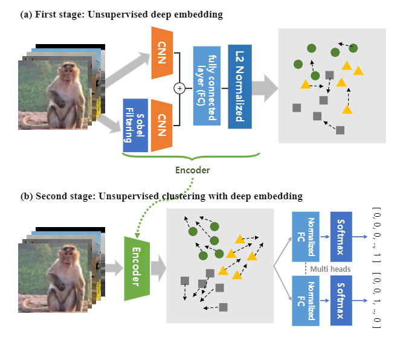
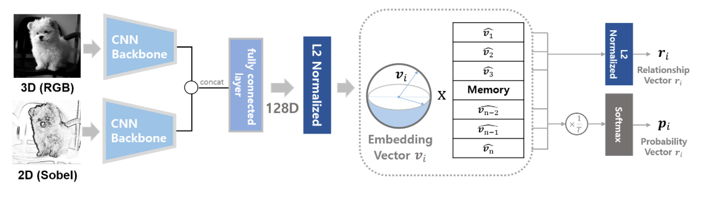
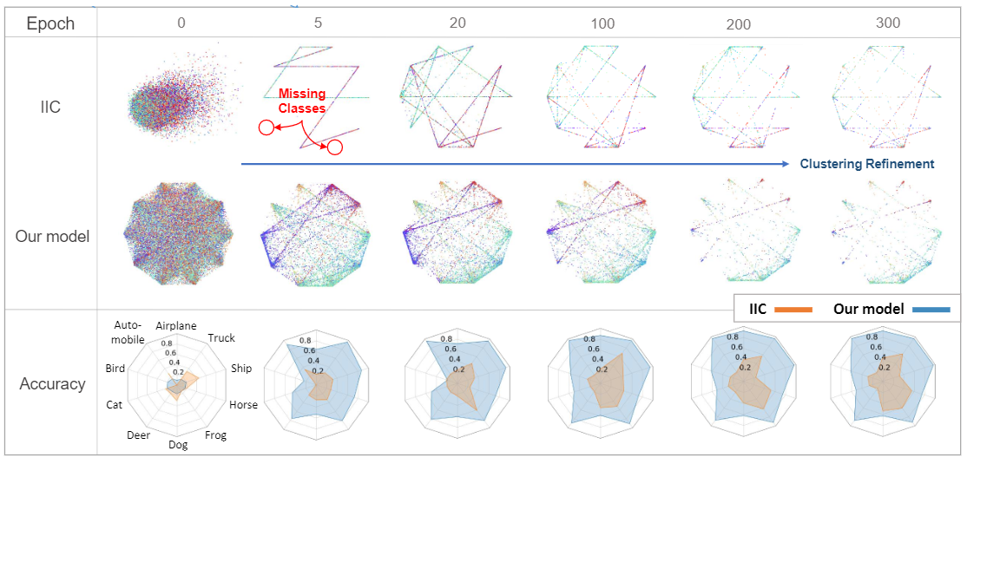
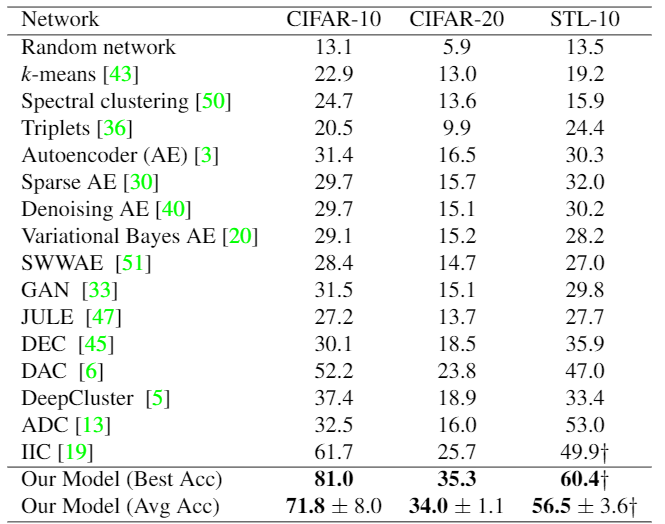

# EmbedUL #
This repository is the pytorch code for "Embedding matters: A novel two-stage unsupervised image classification"
## Highlight ##
* Our model is two-stage classification method, where a pre-trained embedding module precedes a refining module that concurrently tunes the embedding and performs unsupervised image classification.
* Our model outperforms SOTA in multiple datasets, with  substantially  high  accuracy  of  71.8%  for  CIFAR-10(i.e.,  10.1pp increase) and 34.0% for CIFAR-100-20 (i.e.,8.3pp increase) in unsupervised tasks.
## Two stage model architecture ##
<center> </center>

### (a) First stage : Unsupervised deep embedding ### 
The encoder projects input images to a lower dimension embedding sphere via deep embedding (Super-AND). The encoder is trained to gather samples with similar semantic contents nearby and separate them if otherwise.
* Super-AND 
<center></center>

### (b) Second stage : Unsupervised clustering with deep embedding ### 
Multi-head normalized fully-connected layer classifies images byjointly optimizing the clustering and embedding losses.

 

## Result & Experiment ##

### Unsupervised Image Classification Result ###
* We achieve new state of the art unsupervised image classification record on multiple dataset (CIFAR 10, CIFAR 100-20, STL 10)

 

### Confusion Matrix ###
* We examine the confusion matrix between ground truthlabels and classification results. Our model finds the right cluster for most images, although cluster assignment in some classessuch as birds, cats, and dogs is error-prone. Nonetheless, IIC model (previous SOTA) performs far less accurately.

 

## Pretrained Model ##
Currently, we support the pretrained model for our model and super-AND on CIFAR10 dataset.
* [Our model](https://drive.google.com/file/d/1H3ppCkPQNHFEYQS4PLuV26Cp3HpbG4Nb/view?usp=sharing)
* [Super-AND](https://drive.google.com/file/d/1cABTquqOl5N2Wbchxs0-DBI6OVfnqY5J/view?usp=sharing)

## Usage ##
1. Clone the repository

```
https://github.com/EmbedUL/EmbedUL.git
```

2. Stage 1 Implementation on CIFAR 10

```
python3 super_and.py --dataset cifar10
```

3. Stage 2 Implementation on CIFAR 10

```
python3 main.py --resume [stage1 pretrained model]
```


