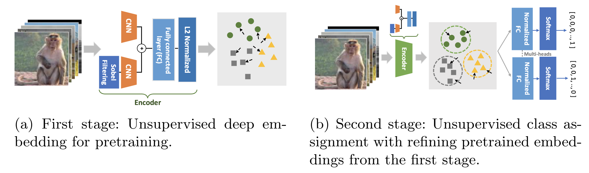
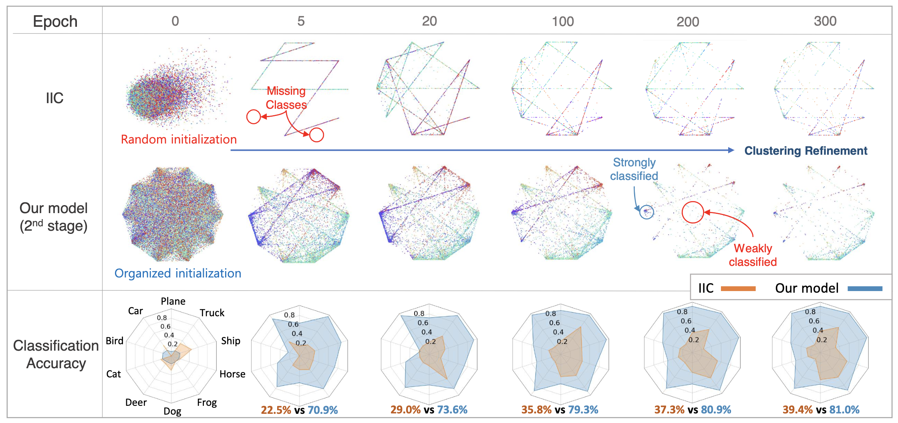
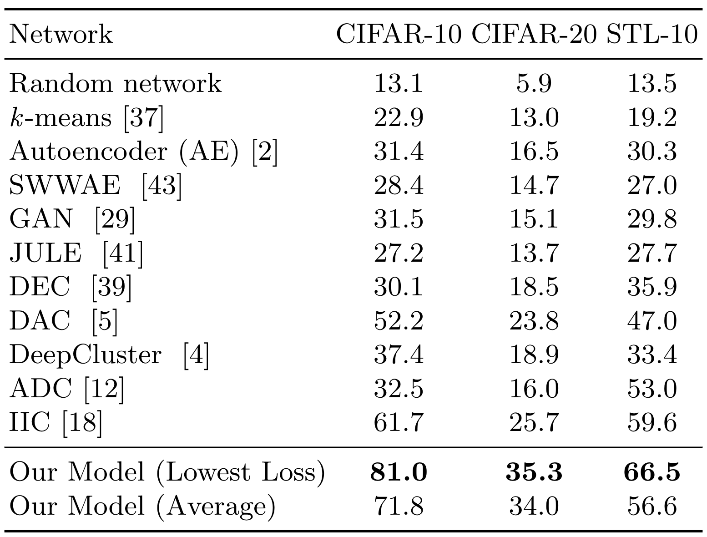
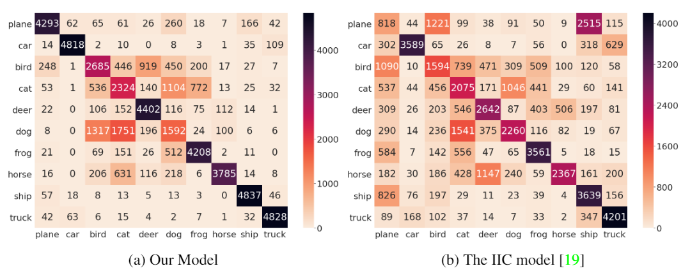

# Pretraining matters: A two-stage algorithm for unsupervised image classification #
This repository is the pytorch code for "Pretraining matters: A two-stage algorithm for unsupervised image classification"
## Highlight ##
* Our two-stage process starts with embedding learning as a pretraining step, which produces a great initialization. The second stage then aims to assign a class for each data point by refining its pretrained embedding. Our model successfully optimizes two objectives without falling into the misaligned state.
* The proposed method outperforms the existing baselines substantially. With the CIFAR-10 dataset, we achieve an accuracy of 81.0%, whereas the best performing alternative reaches 61.7%.
* Extensive experiments and ablation studies confirm that both stages are critical to the overall performance gain. In-depth comparison with the current state-of-the-art (SOTA) methods reveals that a massive advantage of our approach comes from the embedding learning initialization that gathers similar images nearby even in a low-dimensional space.
* Our model can be adopted as a pretraining step for a semi-supervised task with few labels. We show the potential gain in the experiment section.

## Two stage model architecture ##
<center> </center>

### (a) First stage : Unsupervised deep embedding ### 
The encoder projects input images to a lower dimension embedding sphere via deep embedding ([Super-AND](https://github.com/super-AND/super-AND)). The encoder is trained to gather samples with similar semantic contents nearby and separate them if otherwise.
### (b) Second stage: Unsupervised class assignment with refining pretrained embeddings ### 
Multi-head normalized fully-connected layer classifies images by jointly optimizing the clustering and embedding losses.

 

## Result & Experiment ##

### Unsupervised Image Classification Result ###
* We achieve new state of the art unsupervised image classification record on multiple dataset (CIFAR 10, CIFAR 100-20, STL 10)

 

### Confusion Matrix ###
* We examine the confusion matrix between ground truth labels and classification results. Our model finds the right cluster for most images, although cluster assignment in some classes such as birds, cats, and dogs is error-prone. Nonetheless, IIC model (previous SOTA) performs far less accurately.

 

## Pretrained Model ##
Currently, we support the pretrained model for our model and super-AND on CIFAR10 dataset.
* [Our model](https://drive.google.com/file/d/1H3ppCkPQNHFEYQS4PLuV26Cp3HpbG4Nb/view?usp=sharing)
* [Super-AND](https://drive.google.com/file/d/1cABTquqOl5N2Wbchxs0-DBI6OVfnqY5J/view?usp=sharing)

## Usage ##
1. Clone the repository

```
git clone https://github.com/EmbedUL/EmbedUL.git
```

2. Stage 1 Implementation on CIFAR 10

```
python3 super_and.py --dataset cifar10
```

3. Stage 2 Implementation on CIFAR 10

```
python3 main.py --dataset cifar10 --resume [stage1 pretrained model]
```


